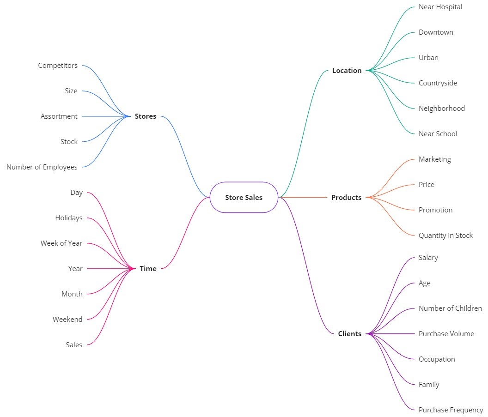
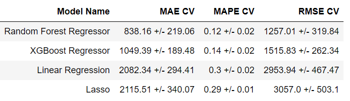

# Six Weeks Sales Forecast - Rossmann Stores

---

## 1.0 The Context
Dirk Rossmann GmbH is Germany's second-largest drug store chain, with over 3,790 stores in Europe. Rossmann store managers are tasked with predicting their daily sales for up to six weeks in advance. Store sales are influenced by many factors, including promotions, competition, school and state holidays, seasonality, and locality. 

 

## 2.0 The Challenge
Offer a simple and optimized AI solution that gives sales forecasts for the next six weeks of the 1115 stores available to Rossmann managers.

  

## 3.0 The Solution
It was proposed a convenient telegram bot. 

The only thing that managers need to do on their cellphones is opening the app telegram and type to RossmannBot the number of the store to see the total amount of money predicted by the AI model for the next six weeks. If the store is available, will be sent a line plot graph that shows the sales predictions by the weeks of the year (starting from the week 31 - July 19h) followed by a message "Store X will sell $XXX,XXX.XX in the next six weeks. Unfortunately, not all of 1115 stores are available, so when it is typed a non-available number it is sent the message "Store number not available". When anything else is typed, like a word, for instance, it is sent the message "This is not a store number. Please, type a store number between 1 and 1115."

  

## 4.0 Project Development

### 4.1 Exploratory Data Analysis 

Descriptive Statistics

#### Key points

-	Mean sales are $5773.82, and can achieve 441551.00 in a single day;
-	The max number of customers at the stores can achieve 7388 in a single day;
-	There are competitors in a minimum range of 20m;
-	At the moment 38% of the stores are running some kind of promotion.
#### Hypothesis Mind Map

To decide the best hypothesis to test it was outlined a brained storm mind map as follows:

 

#### Univariate Analysis

As can be seen the sales curve is not normal showing a moderate asymmetry of 0.64 (positive skewness) and a kurtosis of 1.77 (leptokurtic shape). This implies that there are outliers in the dataset.   

 

#### Bivariate Analysis – Hypothesis Validation

The previous mind map resulted in ten hypotheses selected to validate and generate business insights. The hypothesis and their answers are below:

H1 Stores with higher assortments should sell more.
False - Stores with less assortment sell more

H2 Stores with closer competitors should sell less
False - Stores with close competitors sell more

H3 Stores with long term competitors should sell more
False - Stores with short term competitors sell more

H4 Stores with active promotions should sell more
True - Stores in promo 1 sell more
False - Stores in extended promo (promo 2) sell less

H5 Stores with more consecutive promotions sell more
False - Stores with more consecutive promotions sell less

H6 Stores open during the Christmas holiday should sell more.
False - Stores open during the Christmas holiday should sell less

H7 Stores should sell more over the years.
False - Stores sell less over the years

H8 Stores should sell more in the second half of the year.
False - Stores sell less in the second half of the year

H9 Stores should sell less on weekends.
True - Stores sell less on weekends

H10 Stores should sell less during school holidays.
True - Stores sell less during school holidays

To exemplify one of the insights generate and how it was achieved will be shown the validation process of the second hypothesis (Stores with closer competitors should sell less) that have shown to be false.

As can be seen, contrary to what was thought, stores with close competitors sell more. The idea that a market monopoly in a region is better for business is wrong.

Another example is the ninth hypothesis. It is a common sense the idea that in the weekends the stores should sell more, but the analysis showed the opposite:

As can be observed the bar chart shows a slight drop during the week until Saturday, but on Sunday sales reached their lowest point, which certainly contributed to the high correlation shown in the other two charts.

 

#### Multivariate Analysis

The chart below shows all the correlations among all the numerical features previous selected (columns) of the dataset.

As can be observed just three correlations showed some importance. The correlations are:

0.37 (week correlation) - Promo X Sales

0.45 (medium correlation) - Is_Promo X Promo 2

0.96 (very strong correlation) - Month X Week of Year

Unfortunately, these correlations are unable to significantly impact our decisions on which variables to select for our model, but they are important because we can observe their behavior and use them to improve budget planning and avoid wasting money.

 

### 4.2 Machine Learning Models

For this project it was tested four machine learning models: Linear Regression, Lasso Regression, Random Forest Regressor and XGboost Regressor. The results of cross-validation are shown below:

 

Although Random Forest has shown the best performance, XGBoost may be a better solution, because it is lightweight to deploy. For even better performance, Boruta was chosen as a feature selector to fine-tuning the model. Including all the features selected by Boruta, the performance has had a significant improvement. The result is as follows:

 

### 4.3 Business Performance

From a business perspective there are some examples below of the predictions made:

MAE – Mean Absolute Error
MAPE – Mean Absolute Percentage Error

As can be seen the variation in forecasts considering the error is minimal and the model’s performance is satisfactory. 

#### MAPE Chart

This chart shows some outliers in the predictions made. The dots circled in red are the most difficult stores to predict. Some possibilities to solve this problem are:

-	Review specific data of each one to decide what to do with the values;
-	Try another machine learning models;
-	Make another cycle (CRSIP-DS) of the entire project. 

 

### 4.4 Machine Learning Performance

Key points:

The predictions made are quite close to the real sales, although there is some variance in error rate. This can be seen in observing the first two line plots.

The histogram (3th chart) shows a distribution similar to a normal distribution.

The last chart (scatter plot) shows the majority of the points fit in a tube shape, which means that the variation in error is low.

 

### 4.5 Conclusion and Next Steps

In general, it is possible to conclude that the model performed well and there is no need to go deeper by doing the second cycle of CRISP-DS, as time and resources may not be worthwhile in a real industry situation. Errors are low and the budget can be invested safely. On the other hand, if we decide to go even further, some steps can be followed as follows:

- Try other features to see how much the RMSE is impacted;
- Apply other Machine Learning algorithms to improve business performance by 10%;
- Review hyperparameter fine-tuning strategies to improve RMSE.

---

